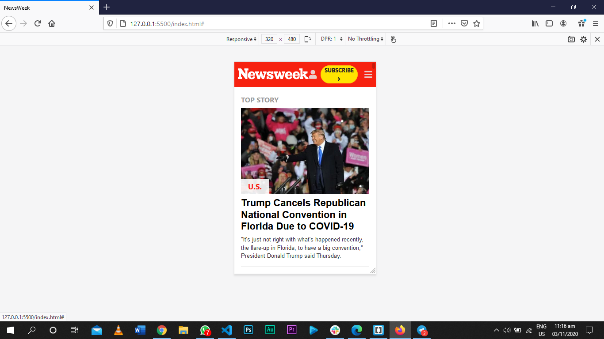

# Bootstrap!

This project is a part from Microverse program, designed to learn how to use position things were we exactly want them. Made with HTML/CSS by  Adetola Adesuyi

## Bootstrap features include:

- Media queries

- Navigation Bar with hovering effects

- Articles.

## Built With

- HTML

- CSS/SCSS

## Live Demo

[Live Demo Link](https://rawcdn.githack.com/Arinpe/Bootstrap/5c932ee480a2953d6db4f25fbe51d3be52b49a3c/index.html)

**See the page via the link above**

**See the Source Page via the link below**

[Source Page Link](https://www.newsweek.com/)

## Author

👤 **Adetola Adesuyi**

- GitHub: [@Arinpe](https://github.com/Arinpe)
- Twitter: [@_detola_](https://twitter.com/_detola_)
- LinkedIn: [LinkedIn](https://www.linkedin.com/in/adesuyi-adetola-7b4451111/)

## Show your support

Give a ⭐️ if you like this project!

## 📝 License

This project is [MIT](LICENSE) licensed.
